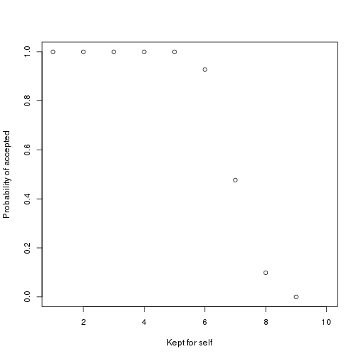

## Ultimatum game

- first player proposes how to split a given amount between himself and the second player

- second player accepts and the amount is split as proposed, or rejects and neither player get anything

--- 

## Strategy of proposer

- learn the minimum amount the second player would consider a fair split and accept

---

## Present version

- second player is the computer

- repeated one-shot (no accumulated earnings)

---

## Probability of split being accepted

 

---
